challenge1  
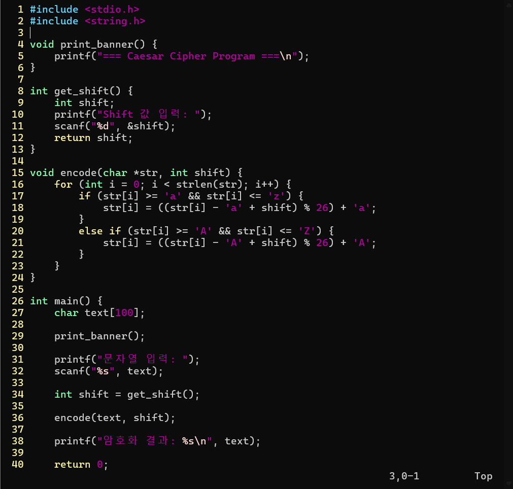  
문자열을 단순히 옆으로 미는 것으로 암호화 시킬 수 있지만 내가 얼마나 밀었는지 모르면 상대방은 암호를 풀 수 없다.  
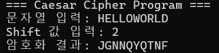  
암호를 공유하는 사람끼리만 해독이 가능하기 때문에 전쟁에서 자주 사용되었다.  

challenge2  
gdb를 사용하여 main함수 전후 rbp, rsp 변화 확인  
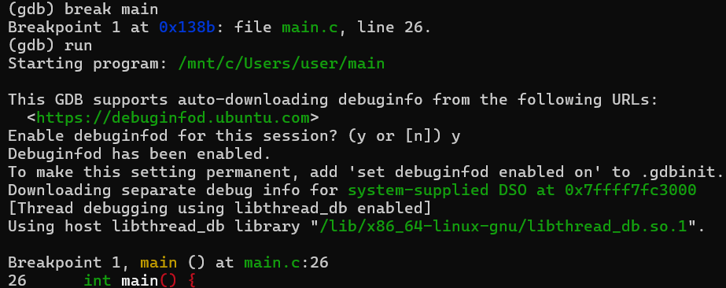  
함수 전  
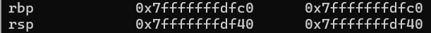  
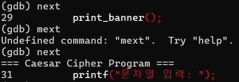  
함수 후  
하지만 변화가 없다.
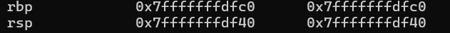  
이전 rbp를 볼 수 있다.  
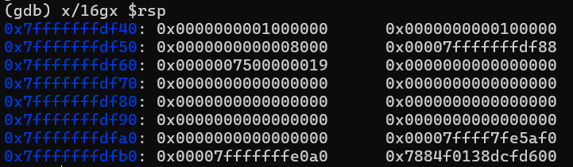  
leave, ret을 통해 rbp, rsp가 다시 돌아온것을 알 수 있다.  
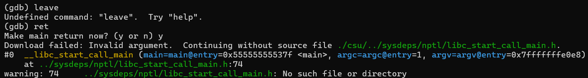  
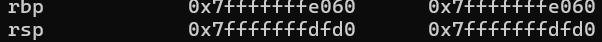  
이전에 next를 이용한 경우 rsp에 변화가 없었는데 이런 경우 함수 내부로 들어가지않아서 변화가 안보이기 때문이다.  
step을 사용하면 변화를 볼 수 있다.  
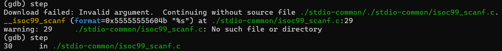  
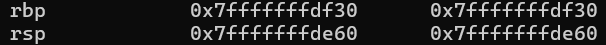  
