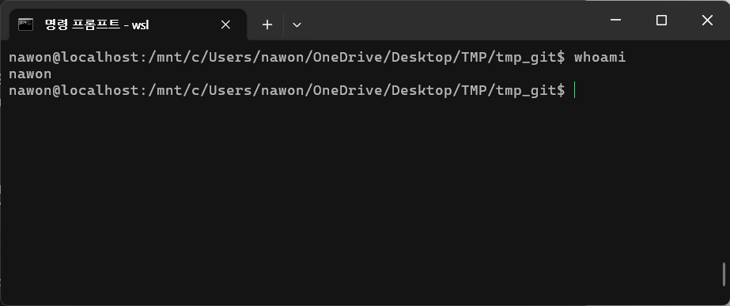

# Week01(03/16 ~ 03/22)

# 과제

### 환경 구축 및 기초 툴과 친해지기

- Challenge1. Linux 환경 구축
    - 본인 운영체제에 맞게 원하는 방법으로 구축
    - VMware, WSL2, VirtualBox, Docker, Cloud 등등
- Challenge2. vim으로 C 기본 코드 작성
    - vim editor로 본인이 원하는 기본 코드 작성하기

### 컴파일 과정 이해하기

- Challenge3. gcc로 컴파일
    - challenge2에서 만든 `.c` 코드를 컴파일하고, 실행하기

---

# 실습

## 0. 환경

### 0.1. 작업 환경

```bash
nawon@localhost:/mnt/c/Users/nawon$ lsb_release -a
No LSB modules are available.
Distributor ID: Ubuntu
Description:    Ubuntu 24.04.3 LTS
Release:        24.04
Codename:       noble
```

- Host OS: Windows
- Linux Environment: WSL2 (Windows Subsystem for Linux)
- Distribution: Ubuntu 24.04.3 LTS

## 1. Linux 환경에서 컴파일

### 1.1. 파일 생성

```bash
vim [파일명].c
```

### 1.2. 코드 작성

```bash
#include <stdio.h>

int main() {
    printf("Hello, World!\n");
    return 0;
}
```

### 1.3. 컴파일

```bash
gcc [대상 파일명].c -o [원하는 파일명]
```

### 1.4. 실행

```bash
./[파일명]
```

### 1.5. 실습 예시

- 현재 로그인한 사용자 이름 확인
    
    
    
- 프로그램 코드 작성
    
    
    
- 컴파일 및 실행
    
    
    

## 2. GitHub 사용

### 2.1. Git 버전 확인

```bash
nawon@localhost:/mnt/c/Users/nawon/OneDrive/Desktop/TMP/tmp_git$ git --version
git version 2.43.0
```

### 2.2. Git 사용자 정보 설정

```bash
git config --global user.name "[이름]"
git config --global user.email "[이메일]"
```

### 2.3. Git 초기화

```bash
git init
```

### 2.4. GitHub 레포지토리 연결

```bash
git remote add origin https://github.com/[깃허브명]/[레포지토리명].git
```

### 2.5. Git에 업로드할 파일 추가

```bash
git add .
or
git add [원하는 파일]
```

### 2.6. 커밋

```bash
git commit -m "[커밋 메세지]"
```

### 2.7. 현재 브랜치 확인

```bash
git branch
```

### 2.8. GitHub에 업로드

```bash
git push -u origin [업로드할 브랜치명]
이후에는 
git push
만 해도 자동으로 위의 브랜치에 push됨
```

### 2.9. GitHub 연결 끊기

```bash
git remote remove origin
```